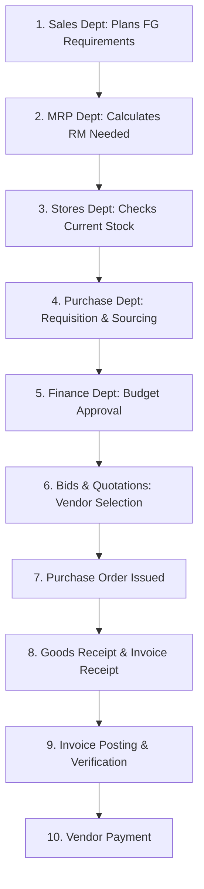

# Accenture Stream Training: SAP S/4HANA Finance
## Day 1 Training Notes & Reference Documentation

Welcome to your study guide and reference documentation for **Day 1** of your SAP S/4HANA Finance Stream Training at Accenture. This document summarizes all the concepts, architectures, financial basics, and SAP configuration steps covered in your training sessions, cross-referenced with your class screenshots.

---

## Table of Contents
1. [Theoretical Foundations of ERP & SAP](#1-theoretical-foundations-of-erp--sap)
   - [What is an ERP?](#what-is-an-erp)
   - [The 4 Ms of Business Resources](#the-4-ms-of-business-resources)
   - [Comparison of Familiar ERP Systems](#comparison-of-familiar-erp-systems)
2. [Business Process Flow: Procure-to-Pay (PTP)](#2-business-process-flow-procure-to-pay-ptp)
   - [Step-by-Step Purchase / PTP Cycle](#step-by-step-purchase--ptp-cycle)
   - [Key Purchasing Documents](#key-purchasing-documents)
3. [SAP Technical Architecture (SAP R/3)](#3-sap-technical-architecture-sap-r3)
   - [The Three-Tier Architecture](#the-three-tier-architecture)
4. [Fundamental Accounting Concepts](#4-fundamental-accounting-concepts)
   - [The Balance Sheet](#the-balance-sheet)
   - [Profit & Loss (P&L) Statement](#profit--loss-pl-statement)
5. [SAP FI (Financial Accounting) Organisational Structure](#5-sap-fi-financial-accounting-organisational-structure)
   - [Organizational Hierarchy](#organizational-hierarchy)
   - [Key Concepts & Definitions](#key-concepts--definitions)
6. [SAP Hands-On Customizing & Configuration Steps](#6-sap-hands-on-customizing--configuration-steps)
   - [SPRO: Accessing the Implementation Guide (IMG)](#spro-accessing-the-implementation-guide-img)
   - [Displaying Technical Activity Keys / T-Codes in IMG](#displaying-technical-activity-keys--t-codes-in-img)
   - [Customizing / Transport Requests (TR)](#customizing--transport-requests-tr)
   - [Configuration Walkthrough (Step-by-Step)](#configuration-walkthrough-step-by-step)
7. [Screenshot Index & Links](#7-screenshot-index--links)
8. [Topics Covered Today](#8-topics-covered-today)

---

## 1. Theoretical Foundations of ERP & SAP

### What is an ERP?
**ERP** stands for **Enterprise Resource Planning**. It is a software system that helps businesses integrate and manage their core processes—such as finance, manufacturing, human resources, supply chain, services, and procurement—into a single, unified database.

### The 4 Ms of Business Resources
To run any business, resources are required. The training categorizes these into the **4 Ms**:
1. **Men (Human Resources)**: Primarily associated with the service and IT industries.
2. **Money (Finance)**: Associated with accounting, finance, treasury, and capital control.
3. **Material (Inventory & Raw Materials)**: Primarily used in manufacturing.
4. **Machinery (Equipment & Production Line)**: Used in manufacturing processes.

*In manufacturing, two core operational planning concepts are used:*
* **Routing**: The step-by-step sequence of operations (or work centers) that a material must go through during production.
* **Scheduling**: Planning and timing production run times to ensure products are manufactured and delivered to the customer on time.

### Comparison of Familiar ERP Systems
Different ERP solutions traditionally specialize in different business sectors:
* **SAP (Systems, Applications, and Products)**: The market leader, integrating all modules (Finance, Logistics, HR, etc.) seamlessly across all industries.
* **Oracle**: Best known for its strong **Financial** modules and database systems.
* **PeopleSoft**: Historically specialized in **HR/HCM (Human Capital Management)** and widely used in service/IT industries.
* **JD Edwards**: Historically focused on **Manufacturing** and supply chain management.
* **Tally**: Used by small and medium enterprises for basic accounting.
* **Ramco**: Known for cloud ERP solutions in logistics, aviation, and HR.

> **Related Screenshot:** [Screenshot 2026-07-08 093836.png](file:///c:/Users/bhata/OneDrive/Desktop/Sap%20s4%20hana%20finance/Day1/Screenshot%202026-07-08%20093836.png)

---

## 2. Business Process Flow: Procure-to-Pay (PTP)

The **Procure-to-Pay (PTP)** cycle (also known as the **Purchase Cycle**) represents the operational flow of how a business acquires raw materials or goods. 



### Step-by-Step Purchase / PTP Cycle
1. **Sales Department**: Identifies customer demand or forecasts finished goods (FG) needed (e.g., *Planned for March: 10,000 units of Finished Goods*).
2. **MRP (Material Requirement Planning) Department**: Calculates what raw materials (RM) are required to manufacture those finished goods (e.g., *Need 5,000 units of Raw Material*).
3. **Stores Department**: Checks stock levels. They issue a **Material Requisition** internally. If the stock is available, they issue it; if not, they request a purchase (e.g., *Available Stock: 3,000 RM; Shortage: 2,000 RM*).
4. **Purchase Department**: Upon receiving the shortage request, they generate a **Purchase Requisition (PR)**.
5. **Finance Department**: Approves the purchase budget.
6. **Bidding/Quotations**: The purchase department requests quotes/tenders from different vendors.
7. **Select Best Vendor**: The best vendor is selected based on key criteria:
   - **Cost** (best price)
   - **Quality** (meets standards)
   - **Quantity** (ability to supply)
   - **Credit Period** (payment terms / duration allowed for payment)
8. **Purchase Order (PO)**: A formal, legally binding document sent to the vendor outlining goods, quantities, and agreed prices.
9. **Goods Receipt (GR) / Invoice Receipt (IR)**: The vendor delivers the materials (Goods Receipt) and sends the bill (Invoice Receipt).
10. **Invoice Posting & Verification**: The system checks the PO, GR, and Invoice to ensure they match (known as the *3-Way Match*).
11. **Vendor Payment**: The Finance department releases the cash/bank payment to the vendor.

> **Related Screenshot:** [Screenshot 2026-07-08 095220.png](file:///c:/Users/bhata/OneDrive/Desktop/Sap%20s4%20hana%20finance/Day1/Screenshot%202026-07-08%20095220.png)

---

## 3. SAP Technical Architecture (SAP R/3)

SAP R/3 introduced the standard **3-tier client-server architecture** which ensures high scalability, reliability, and modularity.

### The Three-Tier Architecture
1. **Presentation Layer (User Interface)**:
   - Runs on the user's local computer (e.g., **SAP GUI** or SAP Business Client).
   - Responsible for rendering menus, forms, input fields, and receiving user commands.
2. **Application Layer (Business Logic)**:
   - Executes the core business logic of SAP applications.
   - Contains components like the **ABAP Workbench**, **Kernel & Basis Services**, and running **SAP Applications**.
   - Processes data received from the Presentation Layer and requests/retrieves data from the Database Layer.
3. **Database Layer (Data Storage)**:
   - Contains the database management system (DBMS) and physical database (e.g., Oracle, DB2, MS SQL, or SAP HANA).
   - Stores all application code, master data, transaction records, and system configurations.

> **Related Screenshot:** [Screenshot 2026-07-08 095605.png](file:///c:/Users/bhata/OneDrive/Desktop/Sap%20s4%20hana%20finance/Day1/Screenshot%202026-07-08%20095605.png)

---

## 4. Fundamental Accounting Concepts

Before configuring SAP Finance (FI), you must understand standard accounting structures. The two core financial reports required by businesses are the **Balance Sheet** and the **Profit & Loss (P&L) Account**.

### The Balance Sheet
The Balance Sheet displays a company’s financial position at a specific point in time. It is structured around the accounting equation: **Assets = Liabilities + Owner’s Equity (Capital)**.

| Liabilities (Sources of Funds) | Assets (Uses of Funds) |
| :--- | :--- |
| **Capital**: Owner's investment. | **Fixed Assets**: Long-term resources (Lands, Buildings, Vehicles, Furniture & Fixtures, Plant & Machinery). |
| **Loans from Banks**: Long-term liabilities. | **Current Assets**: Short-term/liquid resources (Materials/Inventory, Jewelleries, Shares/Investments, Cash in hand, Bank balance, Loans/Advances given). |
| **Loans from Vendors/Creditors**: Accounts Payable. | |
| **Received Advances**: Advances from customers. | |

> **Related Screenshot:** [Screenshot 2026-07-08 105630.png](file:///c:/Users/bhata/OneDrive/Desktop/Sap%20s4%20hana%20finance/Day1/Screenshot%202026-07-08%20105630.png)

### Profit & Loss (P&L) Statement
The P&L statement displays a company’s revenues and expenses over a period. It determines the net profit or loss.

* **Debit (Dr) - Expenses & Losses**: Rent, Interest Paid, Salaries, Wages, Petrol Expenses, Electricity, Postage, Internet.
* **Credit (Cr) - Incomes, Revenues & Gains**: Sales Revenue, Interest Received, Discount Received, Gain on Asset Sale, Rent Received.

> **Related Screenshots:** [Screenshot 2026-07-08 105656.png](file:///c:/Users/bhata/OneDrive/Desktop/Sap%20s4%20hana%20finance/Day1/Screenshot%202026-07-08%20105656.png), [Screenshot 2026-07-08 105702.png](file:///c:/Users/bhata/OneDrive/Desktop/Sap%20s4%20hana%20finance/Day1/Screenshot%202026-07-08%20105702.png)

---

## 5. SAP FI (Financial Accounting) Organisational Structure

SAP’s organizational hierarchy allows companies to structure their business processes to meet legal, operational, and financial requirements.

### Organizational Hierarchy

```
[ OPERATING CONCERN ]   <-- Top level for Profitability Analysis (CO-PA)
         │
         ▼
[ CONTROLLING AREA ]    <-- Core unit for Management Accounting (CO)
         │
    ┌────┼────┐
    ▼    ▼    ▼
 [ COMPANY CODES ]      <-- Legal entities for Financial Reporting (FI)
 (C.CODE-1, C.CODE-2...)
         │
         ▼
[ CHART OF ACCOUNTS ]   <-- Structure containing all G/L accounts
         │
    ┌────┴────┐
    ▼         ▼
[Balance]  [ P&L ]      <-- Individual GL accounts
[ Sheet ]  [ A/C ]
```

### Key Concepts & Definitions

1. **Company**:
   - Represents the parent company or group headquarters level (e.g., **TATA Company**).
   - Creation/Assignment is **optional** in systems where only a single operation exists, but highly recommended for consolidations.
2. **Company Code**:
   - The smallest organizational unit in Financial Accounting for which a complete, self-contained set of accounts (Balance Sheet and P&L) can be drawn up.
   - It is a **legal entity** required for drawing up statutory reports to file with the company registrar (e.g., **TSL** - Tata Steel, **TCS** - Tata Consultancy Services, **TTCL** - Tata Chemicals).
3. **Business Area**:
   - A separate unit within a company code used to generate financial reports (sales, costs, inventory) segmented by **geography** (e.g., Mumbai, Chennai, Bangalore) or **product lines**.
   - Enables internal comparison of business segment performances.

> **Related Screenshots:** [Screenshot 2026-07-08 105722.png](file:///c:/Users/bhata/OneDrive/Desktop/Sap%20s4%20hana%20finance/Day1/Screenshot%202026-07-08%20105722.png), [Screenshot 2026-07-08 110011.png](file:///c:/Users/bhata/OneDrive/Desktop/Sap%20s4%20hana%20finance/Day1/Screenshot%202026-07-08%20110011.png), [Screenshot 2026-07-08 110158.png](file:///c:/Users/bhata/OneDrive/Desktop/Sap%20s4%20hana%20finance/Day1/Screenshot%202026-07-08%20110158.png)

---

## 6. SAP Hands-On Customizing & Configuration Steps

### SPRO: Accessing the Implementation Guide (IMG)
To configure any settings in SAP, consultants use the Transaction Code **`SPRO`** (SAP Project Reference Object) and click on **SAP Reference IMG**. The IMG organizes configuration steps in a tree structure.

> **Related Screenshot:** [Screenshot 2026-07-08 110730.png](file:///c:/Users/bhata/OneDrive/Desktop/Sap%20s4%20hana%20finance/Day1/Screenshot%202026-07-08%20110730.png)

### Displaying Technical Activity Keys / T-Codes in IMG
By default, SAP hides the transaction codes (T-codes) and customizing keys in the IMG structure. You can display them using this menu path:
* **Menu Path**: `Additional Information` -> `Additional Information` -> `Display Key` -> `IMG Activity`
* Once enabled, a column appears on the right. The last 4 characters of the key often correspond directly to the standalone transaction code (e.g. `OX15`, `OX02`, `OX03`, `OX16`).

| Customizing Node | Technical Activity Key | Standalone T-Code |
| :--- | :--- | :--- |
| **Define Company** | `SIMG_CFMENUSAPCOX15` | **`OX15`** |
| **Edit, Copy, Delete, Check Company Code** | `SIMG_CFMENUSAPCOX02` | **`OX02`** |
| **Define Business Area** | `SIMG_CFMENUSAPCOX03` | **`OX03`** |
| **Assign Company Code to Company** | `SIMG_CFMENUSAPCOX16` | **`OX16`** |

> **Related Screenshot:** [Screenshot 2026-07-08 110955.png](file:///c:/Users/bhata/OneDrive/Desktop/Sap%20s4%20hana%20finance/Day1/Screenshot%202026-07-08%20110955.png)

### Customizing / Transport Requests (TR)
Whenever configuration changes are made in SAP, they are recorded in a **Customizing Request** (also known as a **Transport Request** or **TR**).
* TRs are used to migrate configuration settings from the **Development** system to the **Quality/Testing** system, and finally to the **Production** system.
* You can create a new request by clicking the **Create Request (F8)** icon in the prompt window, typing a short description (e.g., `MAK9 Group Settings`), and saving. This generates a unique request ID (e.g., `L4CK900086`).

> **Related Screenshots:** [Screenshot 2026-07-08 112114.png](file:///c:/Users/bhata/OneDrive/Desktop/Sap%20s4%20hana%20finance/Day1/Screenshot%202026-07-08%20112114.png), [Screenshot 2026-07-08 112225.png](file:///c:/Users/bhata/OneDrive/Desktop/Sap%20s4%20hana%20finance/Day1/Screenshot%202026-07-08%20112225.png)

---

### Configuration Walkthrough (Step-by-Step)

#### Step 1: Define Company (T-code `OX15`)
* **Menu Path**: `Enterprise Structure` -> `Definition` -> `Financial Accounting` -> `Define company`
* **Table**: `V_T880`
* **Action**: Creates the group-level corporate entity representing your company.

#### Step 2: Define Company Code (T-code `OX02`)
* **Menu Path**: `Enterprise Structure` -> `Definition` -> `Financial Accounting` -> `Edit, Copy, Delete, Check Company Code`
* **Action**: Define the legal entity `MAK9` (representing *MAK9 Industries Ltd*, located in City *BANGALORE*).
* > **Related Screenshot:** [Screenshot 2026-07-08 112659.png](file:///c:/Users/bhata/OneDrive/Desktop/Sap%20s4%20hana%20finance/Day1/Screenshot%202026-07-08%20112659.png)

#### Step 3: Define Business Areas (T-code `OX03`)
* **Menu Path**: `Enterprise Structure` -> `Definition` -> `Financial Accounting` -> `Define Business Area`
* **Action**: Click "New Entries" and add the following codes for regional reporting:
  - `MAKB` -> `BANGALORE BA`
  - `MAKH` -> `HYDERBAD BA`
  - `MAKM` -> `MUMBAI BA`
* > **Related Screenshots:** [Screenshot 2026-07-08 113235.png](file:///c:/Users/bhata/OneDrive/Desktop/Sap%20s4%20hana%20finance/Day1/Screenshot%202026-07-08%20113235.png), [Screenshot 2026-07-08 113339.png](file:///c:/Users/bhata/OneDrive/Desktop/Sap%20s4%20hana%20finance/Day1/Screenshot%202026-07-08%20113339.png)

#### Step 4: Assign Company Code to Company (T-code `OX16`)
* **Menu Path**: `Enterprise Structure` -> `Assignment` -> `Financial Accounting` -> `Assign company code to company`
* **Action**: 
  1. Click **Position...** and enter your Company Code `MAK9`.
  2. In the `Company` column next to Company Code `MAK9`, type **`MAK9`** (associating the Company Code with the parent Group Company).
  3. Click **Save** and save the changes to your Transport Request.
* > **Related Screenshots:** [Screenshot 2026-07-08 113700.png](file:///c:/Users/bhata/OneDrive/Desktop/Sap%20s4%20hana%20finance/Day1/Screenshot%202026-07-08%20113700.png), [Screenshot 2026-07-08 113729.png](file:///c:/Users/bhata/OneDrive/Desktop/Sap%20s4%20hana%20finance/Day1/Screenshot%202026-07-08%20113729.png), [Screenshot 2026-07-08 113835.png](file:///c:/Users/bhata/OneDrive/Desktop/Sap%20s4%20hana%20finance/Day1/Screenshot%202026-07-08%20113835.png)

---

## 7. Screenshot Index & Links

Below is the directory list of all Day 1 screenshots for easy access:

1. **[Screenshot 09:38:36](file:///c:/Users/bhata/OneDrive/Desktop/Sap%20s4%20hana%20finance/Day1/Screenshot%202026-07-08%20093836.png)**: ERP Background, 4 Ms, Familiar ERPs.
2. **[Screenshot 09:52:20](file:///c:/Users/bhata/OneDrive/Desktop/Sap%20s4%20hana%20finance/Day1/Screenshot%202026-07-08%20095220.png)**: PTP / Purchase Cycle Flow chart.
3. **[Screenshot 09:56:05](file:///c:/Users/bhata/OneDrive/Desktop/Sap%20s4%20hana%20finance/Day1/Screenshot%202026-07-08%20095605.png)**: SAP R/3 3-Tier Architecture.
4. **[Screenshot 10:56:30](file:///c:/Users/bhata/OneDrive/Desktop/Sap%20s4%20hana%20finance/Day1/Screenshot%202026-07-08%20105630.png)**: Balance Sheet accounting terms.
5. **[Screenshot 10:56:56](file:///c:/Users/bhata/OneDrive/Desktop/Sap%20s4%20hana%20finance/Day1/Screenshot%202026-07-08%20105656.png)**: P&L Statement Debit & Credit items.
6. **[Screenshot 10:57:02](file:///c:/Users/bhata/OneDrive/Desktop/Sap%20s4%20hana%20finance/Day1/Screenshot%202026-07-08%20105702.png)**: Updated P&L Statement (added internet).
7. **[Screenshot 10:57:22](file:///c:/Users/bhata/OneDrive/Desktop/Sap%20s4%20hana%20finance/Day1/Screenshot%202026-07-08%20105722.png)**: SAP FI Organizational Structure Hierarchy.
8. **[Screenshot 11:00:11](file:///c:/Users/bhata/OneDrive/Desktop/Sap%20s4%20hana%20finance/Day1/Screenshot%202026-07-08%20110011.png)**: Organizational Terms Example (TATA).
9. **[Screenshot 11:01:58](file:///c:/Users/bhata/OneDrive/Desktop/Sap%20s4%20hana%20finance/Day1/Screenshot%202026-07-08%20110158.png)**: Key Definitions (Company vs. Company Code vs. Business Area).
10. **[Screenshot 11:07:30](file:///c:/Users/bhata/OneDrive/Desktop/Sap%20s4%20hana%20finance/Day1/Screenshot%202026-07-08%20110730.png)**: SAP SPRO Display IMG path.
11. **[Screenshot 11:09:55](file:///c:/Users/bhata/OneDrive/Desktop/Sap%20s4%20hana%20finance/Day1/Screenshot%202026-07-08%20110955.png)**: Displaying Technical Activity Keys in IMG.
12. **[Screenshot 11:21:14](file:///c:/Users/bhata/OneDrive/Desktop/Sap%20s4%20hana%20finance/Day1/Screenshot%202026-07-08%20112114.png)**: Prompt for Customizing Request (TR).
13. **[Screenshot 11:22:25](file:///c:/Users/bhata/OneDrive/Desktop/Sap%20s4%20hana%20finance/Day1/Screenshot%202026-07-08%20112225.png)**: Creating a new TR screen (`MAK9 Group Settings`).
14. **[Screenshot 11:26:59](file:///c:/Users/bhata/OneDrive/Desktop/Sap%20s4%20hana%20finance/Day1/Screenshot%202026-07-08%20112659.png)**: Edit, Copy, Delete, Check Company Code node in SPRO.
15. **[Screenshot 11:32:35](file:///c:/Users/bhata/OneDrive/Desktop/Sap%20s4%20hana%20finance/Day1/Screenshot%202026-07-08%20113235.png)**: Define Business Area node in SPRO.
16. **[Screenshot 11:33:39](file:///c:/Users/bhata/OneDrive/Desktop/Sap%20s4%20hana%20finance/Day1/Screenshot%202026-07-08%20113339.png)**: Adding Business Area entries (`MAKB`, `MAKH`, `MAKM`).
17. **[Screenshot 11:37:00](file:///c:/Users/bhata/OneDrive/Desktop/Sap%20s4%20hana%20finance/Day1/Screenshot%202026-07-08%20113700.png)**: Assign Company Code to Company node in SPRO.
18. **[Screenshot 11:37:29](file:///c:/Users/bhata/OneDrive/Desktop/Sap%20s4%20hana%20finance/Day1/Screenshot%202026-07-08%20113729.png)**: Finding Company Code `MAK9` in assignment table.
19. **[Screenshot 11:38:35](file:///c:/Users/bhata/OneDrive/Desktop/Sap%20s4%20hana%20finance/Day1/Screenshot%202026-07-08%20113835.png)**: Assigning Company `MAK9` to Company Code `MAK9` and saving.

---

## 8. Topics Covered Today

According to the **SAP S/4HANA Finance Daywise Plan**, Day 1 focuses on foundational overviews and organizational structures:
* **SAP & S/4 HANA Overview**: SAP Fiori (Introduction), Business Process Overview (Procure-to-Pay), Financial Accounting Overview, SAP Navigation, and the Transport Management System.
* **FI - Org Structure**: Core Organizational Structures in S/4HANA (Defining Company, Company Code, and Business Areas).
